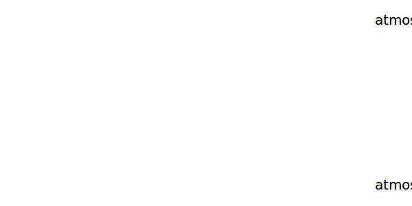

.. _atmosphere.EASFL100:

Parameter: EASFL100
^^^^^^^^^^^^^^^^^^^^^^^^^^^^^^^^^^^^^^^^^^^^^^^^^^^^^^^^

    equivalent airspeed at FL100 
    

Calculation Methods
"""""""""""""""""""""""""""""""""""""""""""""""""""""""
.. automethod:: VAMPzero.Component.Atmosphere.FL100.EASFL100.EASFL100.calc

   :Dependencies: 
   * :ref:`atmosphere.TASFL100`
   * :ref:`atmosphere.sigmaFL100`

   :Sensitivities: 

