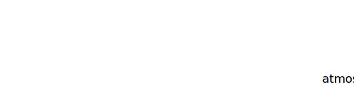

.. _atmosphere.TAP:

Parameter: TAP
^^^^^^^^^^^^^^^^^^^^^^^^^^^^^^^^^^^^^^^^^^^^^^^^^^^^^^^^

    temperature at airport level
    @todo calcTAP, TCR, TFL1500 introduce deltaT to standard Atmosphere 
    

Calculation Methods
"""""""""""""""""""""""""""""""""""""""""""""""""""""""
.. automethod:: VAMPzero.Component.Atmosphere.Airport.TAP.TAP.calc

   :Dependencies: 
   * :ref:`atmosphere.hAP`

   :Sensitivities: 

