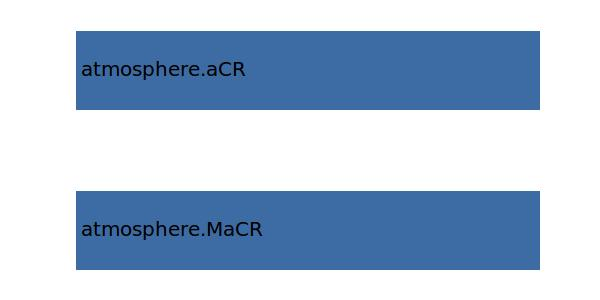

.. _atmosphere.TASCR:

Parameter: TASCR
^^^^^^^^^^^^^^^^^^^^^^^^^^^^^^^^^^^^^^^^^^^^^^^^^^^^^^^^

    true airspeed at cruise condition 
    

Calculation Methods
"""""""""""""""""""""""""""""""""""""""""""""""""""""""
.. automethod:: VAMPzero.Component.Atmosphere.Cruise.TASCR.TASCR.calc

   :Dependencies: 
   * :ref:`atmosphere.MaCR`
   * :ref:`atmosphere.aCR`

   :Sensitivities: 

