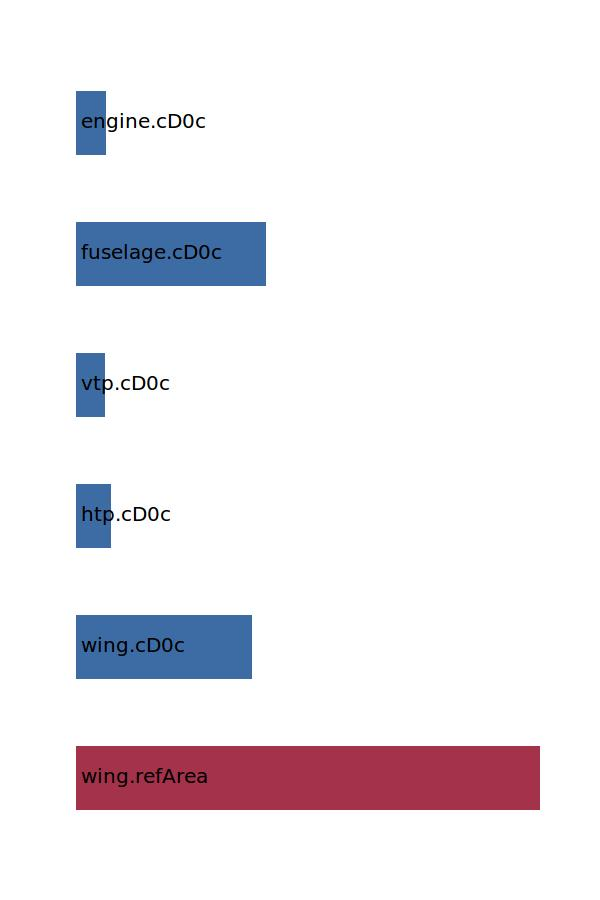

.. _aircraft.cD0:

Parameter: cD0
^^^^^^^^^^^^^^^^^^^^^^^^^^^^^^^^^^^^^^^^^^^^^^^^^^^^^^^^

    In aerodynamics, the zero-lift drag coefficient CD0 is 
    a dimensionless parameter which relates an aircraft's 
    zero-lift drag force to its size, speed, and flying altitude.
    
    :Unit: [ ]
    :Wiki: http://en.wikipedia.org/wiki/Zero-lift_drag_coefficient 
    

Calculation Methods
"""""""""""""""""""""""""""""""""""""""""""""""""""""""
.. automethod:: VAMPzero.Component.Main.Aerodynamic.cD0.cD0.calc

   :Dependencies: 
   * :ref:`wing.refArea`
   * :ref:`wing.cD0c`
   * :ref:`htp.cD0c`
   * :ref:`vtp.cD0c`
   * :ref:`fuselage.cD0c`
   * :ref:`engine.cD0c`

   :Sensitivities: 

