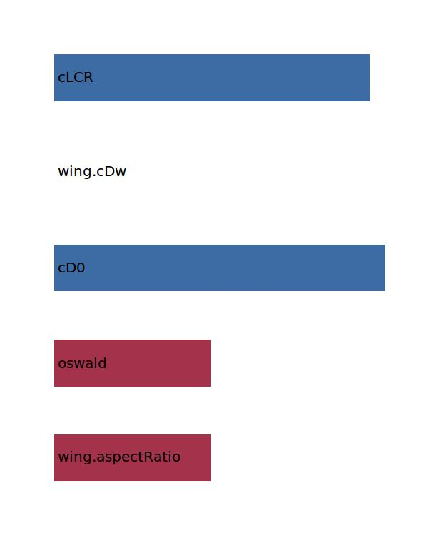

.. _aircraft.cDCR:

Parameter: cDCR
^^^^^^^^^^^^^^^^^^^^^^^^^^^^^^^^^^^^^^^^^^^^^^^^^^^^^^^^

    Drag coefficient for cruise condition
    
    In fluid dynamics, the drag coefficient 
    is a dimensionless quantity that is used 
    to quantify the drag or resistance of an 
    object in a fluid environment such as air or water. 
    It is used in the drag equation, where a lower drag 
    coefficient indicates the object will have less aerodynamic 
    or hydrodynamic drag. The drag coefficient is always 
    associated with a particular surface area
    
    :Wiki: http://en.wikipedia.org/wiki/Drag_coefficient
    :Unit: [ ] 
    

Calculation Methods
"""""""""""""""""""""""""""""""""""""""""""""""""""""""
.. automethod:: VAMPzero.Component.Main.Aerodynamic.cDCR.cDCR.calc

   :Dependencies: 
   * :ref:`wing.aspectRatio`
   * :ref:`aircraft.oswald`
   * :ref:`aircraft.cD0`
   * :ref:`wing.cDw`
   * :ref:`aircraft.cLCR`

   :Sensitivities: 

