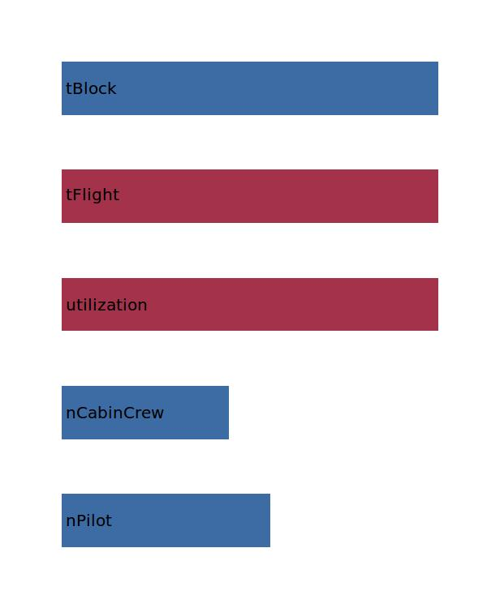

.. _aircraft.costCrew:

Parameter: costCrew
^^^^^^^^^^^^^^^^^^^^^^^^^^^^^^^^^^^^^^^^^^^^^^^^^^^^^^^^

    The crew costs per flight hour
    
    :Unit: [EU/h]
    

Calculation Methods
"""""""""""""""""""""""""""""""""""""""""""""""""""""""
.. automethod:: VAMPzero.Component.Main.DOC.costCrew.costCrew.calc

   :Dependencies: 
   * :ref:`aircraft.nPilot`
   * :ref:`aircraft.nCabinCrew`
   * :ref:`aircraft.utilization`
   * :ref:`aircraft.tFlight`
   * :ref:`aircraft.tBlock`

   :Sensitivities: 

.. automethod:: VAMPzero.Component.Main.DOC.costCrew.costCrew.calcEurocontrol

   :Dependencies: 
   * :ref:`aircraft.nPilot`
   * :ref:`aircraft.nCabinCrew`

   :Sensitivities: 
.. image:: calcEurocontrol.jpg 
   :width: 80% 

