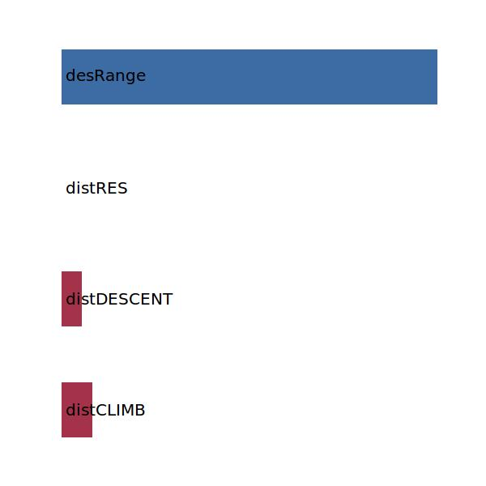
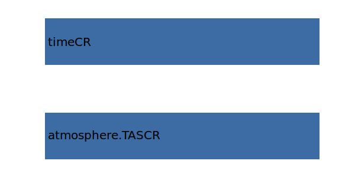

.. _aircraft.distCR:

Parameter: distCR
^^^^^^^^^^^^^^^^^^^^^^^^^^^^^^^^^^^^^^^^^^^^^^^^^^^^^^^^

    The distance traveled during the cruise segment
    
    :Unit: [m] 
    

Calculation Methods
"""""""""""""""""""""""""""""""""""""""""""""""""""""""
.. automethod:: VAMPzero.Component.Main.Performance.distCR.distCR.calc

   :Dependencies: 
   * :ref:`aircraft.distCLIMB`
   * :ref:`aircraft.distDESCENT`
   * :ref:`aircraft.distRES`
   * :ref:`aircraft.desRange`

   :Sensitivities: 

.. automethod:: VAMPzero.Component.Main.Performance.distCR.distCR.calcFixFuel

   :Dependencies: 
   * :ref:`atmosphere.TASCR`
   * :ref:`aircraft.timeCR`

   :Sensitivities: 

.. automethod:: VAMPzero.Component.Main.Performance.distCR.distCR.calcFixRange

   :Dependencies: 
   * :ref:`aircraft.distCLIMB`
   * :ref:`aircraft.distDESCENT`
   * :ref:`aircraft.distRES`
   * :ref:`aircraft.desRange`

   :Sensitivities: 

