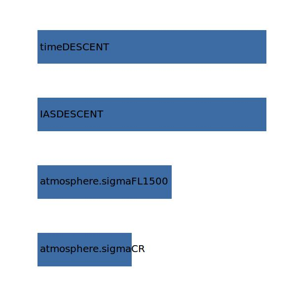

.. _aircraft.distDESCENT:

Parameter: distDESCENT
^^^^^^^^^^^^^^^^^^^^^^^^^^^^^^^^^^^^^^^^^^^^^^^^^^^^^^^^

    The distance traveled in the descent segment
    
    :Unit: [m] 
    

Calculation Methods
"""""""""""""""""""""""""""""""""""""""""""""""""""""""
.. automethod:: VAMPzero.Component.Main.Performance.distDESCENT.distDESCENT.calc

   :Dependencies: 
   * :ref:`atmosphere.sigmaCR`
   * :ref:`atmosphere.sigmaFL1500`
   * :ref:`aircraft.IASDESCENT`
   * :ref:`aircraft.timeDESCENT`

   :Sensitivities: 

