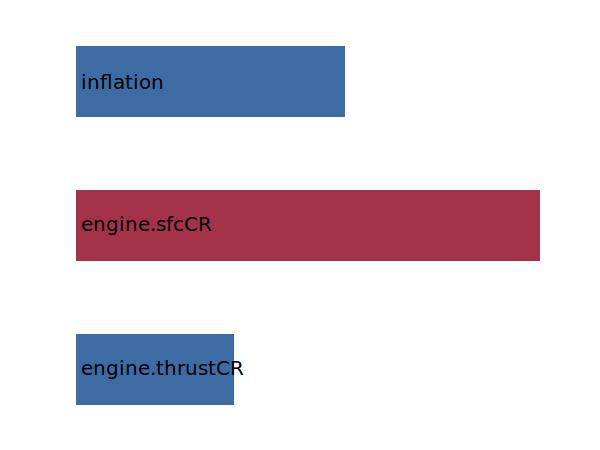
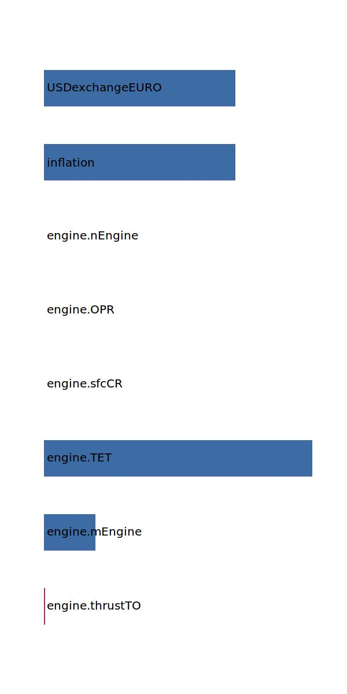

.. _engine.PriceEngine:

Parameter: PriceEngine
^^^^^^^^^^^^^^^^^^^^^^^^^^^^^^^^^^^^^^^^^^^^^^^^^^^^^^^^

    Price for an Engine
	
    :Unit: [Euro]
    

Calculation Methods
"""""""""""""""""""""""""""""""""""""""""""""""""""""""
.. automethod:: VAMPzero.Component.Engine.Cost.PriceEngine.PriceEngine.calc

   :Dependencies: 
   * :ref:`engine.thrustTO`
   * :ref:`engine.mEngine`
   * :ref:`engine.TET`
   * :ref:`engine.sfcCR`
   * :ref:`engine.OPR`
   * :ref:`engine.nEngine`
   * :ref:`aircraft.inflation`
   * :ref:`aircraft.USDexchangeEURO`

   :Sensitivities: 
.. image:: calc.jpg 
   :width: 80% 

.. automethod:: VAMPzero.Component.Engine.Cost.PriceEngine.PriceEngine.calcJenk

   :Dependencies: 
   * :ref:`engine.thrustCR`
   * :ref:`engine.sfcCR`
   * :ref:`aircraft.inflation`

   :Sensitivities: 

.. automethod:: VAMPzero.Component.Engine.Cost.PriceEngine.PriceEngine.calcLang

   :Dependencies: 
   * :ref:`engine.thrustTO`
   * :ref:`engine.mEngine`
   * :ref:`engine.TET`
   * :ref:`engine.sfcCR`
   * :ref:`engine.OPR`
   * :ref:`engine.nEngine`
   * :ref:`aircraft.inflation`
   * :ref:`aircraft.USDexchangeEURO`

   :Sensitivities: 

