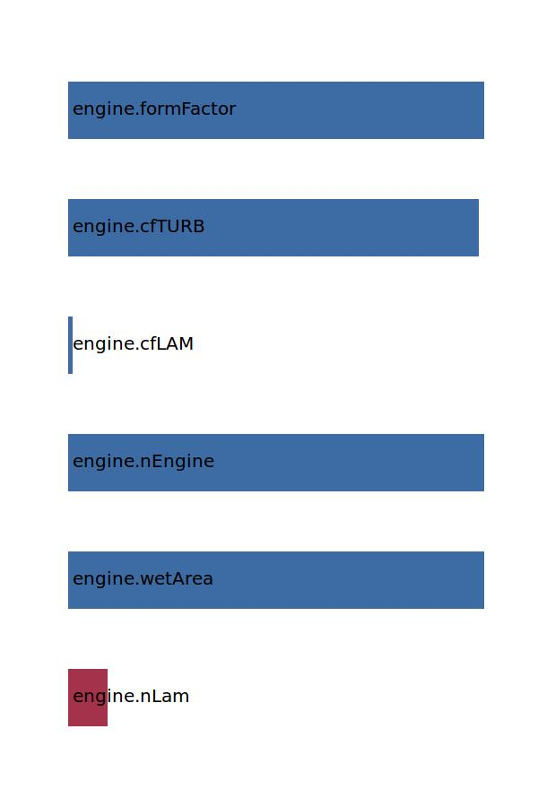

.. _engine.cD0c:

Parameter: cD0c
^^^^^^^^^^^^^^^^^^^^^^^^^^^^^^^^^^^^^^^^^^^^^^^^^^^^^^^^

    Component zero lift drag coefficient of the engine
	
    :Unit: [ ]
    :Wiki: http://en.wikipedia.org/wiki/Drag_coefficient
    

Calculation Methods
"""""""""""""""""""""""""""""""""""""""""""""""""""""""
.. automethod:: VAMPzero.Component.Engine.Aerodynamic.cD0c.cD0c.calc

   :Dependencies: 
   * :ref:`engine.nLam`
   * :ref:`engine.wetArea`
   * :ref:`engine.nEngine`
   * :ref:`engine.cfLAM`
   * :ref:`engine.cfTURB`
   * :ref:`engine.formFactor`

   :Sensitivities: 

