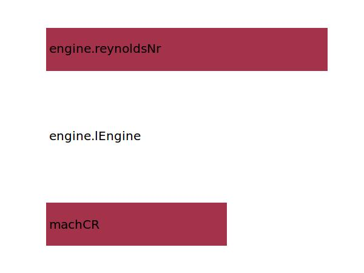

.. _engine.cfTURB:

Parameter: cfTURB
^^^^^^^^^^^^^^^^^^^^^^^^^^^^^^^^^^^^^^^^^^^^^^^^^^^^^^^^
    
    Turbulent friction coefficient

    :Unit: [ ]
    :Wiki: http://en.wikipedia.org/wiki/Parasitic_drag	
    

Calculation Methods
"""""""""""""""""""""""""""""""""""""""""""""""""""""""
.. automethod:: VAMPzero.Component.Engine.Aerodynamic.cfTURB.cfTURB.calc

   :Dependencies: 
   * :ref:`aircraft.machCR`
   * :ref:`engine.lEngine`
   * :ref:`engine.reynoldsNr`

   :Sensitivities: 

