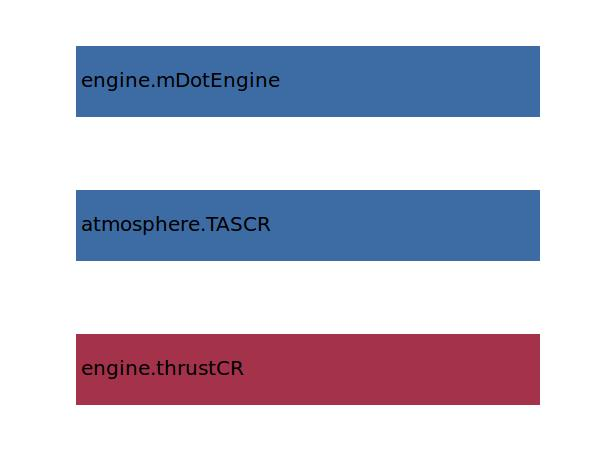

.. _engine.etaProp:

Parameter: etaProp
^^^^^^^^^^^^^^^^^^^^^^^^^^^^^^^^^^^^^^^^^^^^^^^^^^^^^^^^

    Propulsive efficiency factor
	
    :Unit: [ ]
    :Wiki: http://en.wikipedia.org/wiki/Propulsive_efficiency
    

Calculation Methods
"""""""""""""""""""""""""""""""""""""""""""""""""""""""
.. automethod:: VAMPzero.Component.Engine.Propulsion.etaProp.etaProp.calc

   :Dependencies: 
   * :ref:`engine.thrustCR`
   * :ref:`atmosphere.TASCR`
   * :ref:`engine.mDotEngine`

   :Sensitivities: 

