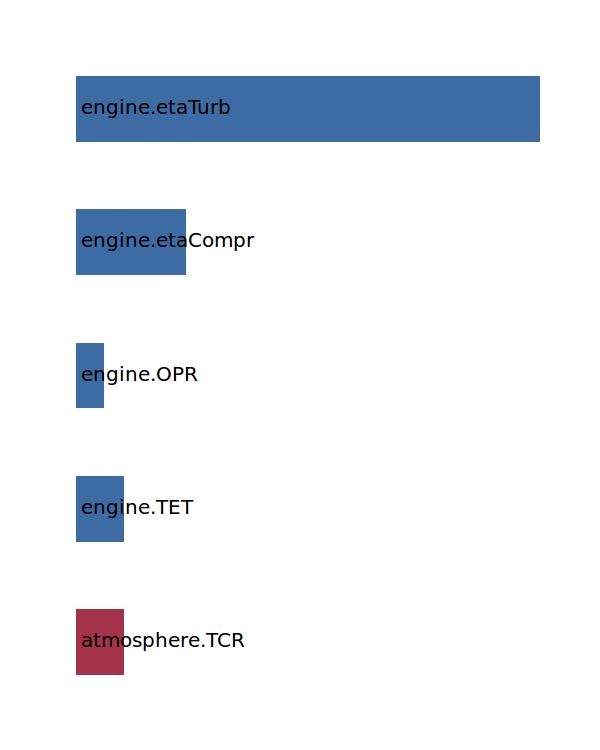

.. _engine.etaTherm:

Parameter: etaTherm
^^^^^^^^^^^^^^^^^^^^^^^^^^^^^^^^^^^^^^^^^^^^^^^^^^^^^^^^

    Thermal efficiency factor

    :Unit: [ ]
    :Wiki: http://en.wikipedia.org/wiki/Thermal_efficiency
    

Calculation Methods
"""""""""""""""""""""""""""""""""""""""""""""""""""""""
.. automethod:: VAMPzero.Component.Engine.Propulsion.etaTherm.etaTherm.calc

   :Dependencies: 
   * :ref:`atmosphere.TCR`
   * :ref:`engine.TET`
   * :ref:`engine.OPR`
   * :ref:`engine.etaCompr`
   * :ref:`engine.etaTurb`

   :Sensitivities: 

