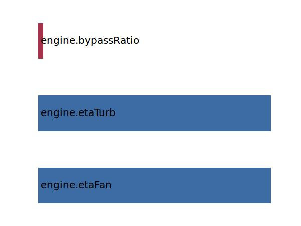

.. _engine.etaTransm:

Parameter: etaTransm
^^^^^^^^^^^^^^^^^^^^^^^^^^^^^^^^^^^^^^^^^^^^^^^^^^^^^^^^

    Transmission efficiency factor
	
    :Unit: [ ]
    

Calculation Methods
"""""""""""""""""""""""""""""""""""""""""""""""""""""""
.. automethod:: VAMPzero.Component.Engine.Propulsion.etaTransm.etaTransm.calc

   :Dependencies: 
   * :ref:`engine.etaFan`
   * :ref:`engine.etaTurb`
   * :ref:`engine.bypassRatio`

   :Sensitivities: 

