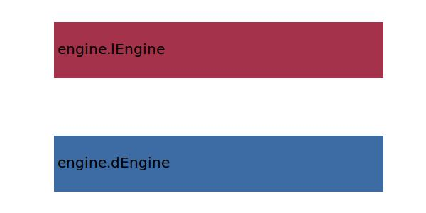

.. _engine.formFactor:

Parameter: formFactor
^^^^^^^^^^^^^^^^^^^^^^^^^^^^^^^^^^^^^^^^^^^^^^^^^^^^^^^^

    The parasite drag associated with skin friction and pressure drag is determined 
    by incrementing the flat plate results by a factor, to account for 
    pressure drag and the higher-than-freestream surface velocities:

    :Unit: [ ]
    :Wiki: http://adg.stanford.edu/aa241/drag/formfactor.html	
    

Calculation Methods
"""""""""""""""""""""""""""""""""""""""""""""""""""""""
.. automethod:: VAMPzero.Component.Engine.Aerodynamic.formFactor.formFactor.calc

   :Dependencies: 
   * :ref:`engine.dEngine`
   * :ref:`engine.lEngine`

   :Sensitivities: 

