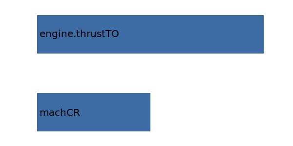

.. _engine.lEngine:

Parameter: lEngine
^^^^^^^^^^^^^^^^^^^^^^^^^^^^^^^^^^^^^^^^^^^^^^^^^^^^^^^^

    length of the engine

    :Unit: [m]
    

Calculation Methods
"""""""""""""""""""""""""""""""""""""""""""""""""""""""
.. automethod:: VAMPzero.Component.Engine.Geometry.lEngine.lEngine.calc

   :Dependencies: 
   * :ref:`aircraft.machCR`
   * :ref:`engine.thrustTO`

   :Sensitivities: 

CPACS Import
"""""""""""""""""""""""""""""""""""""""""""""""""""""""
The values for lEngine are imported from:

.. code-block:: xml

   <cpacs>
      <vehicles>
         <engines>
            <engine>
               <geometry>
                  <length>

CPACS Export
-------------------
The values for lEngine are exported to:

.. code-block:: xml

   <cpacs>
      <vehicles>
         <engines>
            <engine>
               <geometry>
                  <length>

