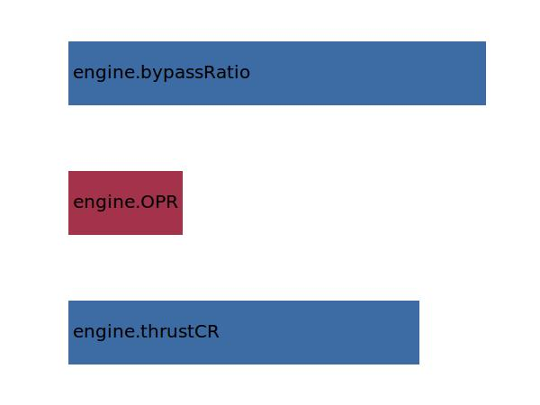

.. _engine.mDotEngine:

Parameter: mDotEngine
^^^^^^^^^^^^^^^^^^^^^^^^^^^^^^^^^^^^^^^^^^^^^^^^^^^^^^^^

    Mass flow rate through the engine 
	
    :Unit: [kg/s]
    

Calculation Methods
"""""""""""""""""""""""""""""""""""""""""""""""""""""""
.. automethod:: VAMPzero.Component.Engine.Propulsion.mDotEngine.mDotEngine.calc

   :Dependencies: 
   * :ref:`engine.thrustCR`
   * :ref:`engine.OPR`
   * :ref:`engine.bypassRatio`

   :Sensitivities: 

