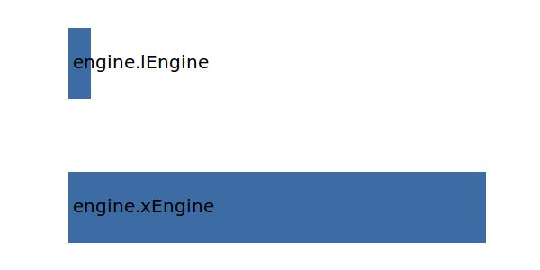

.. _engine.posCoG:

Parameter: posCoG
^^^^^^^^^^^^^^^^^^^^^^^^^^^^^^^^^^^^^^^^^^^^^^^^^^^^^^^^

    X Position of the center of gravity of the engine
	
    :Unit: [m]
    

Calculation Methods
"""""""""""""""""""""""""""""""""""""""""""""""""""""""
.. automethod:: VAMPzero.Component.Engine.CoG.posCoG.posCoG.calc

   :Dependencies: 
   * :ref:`engine.xEngine`
   * :ref:`engine.lEngine`

   :Sensitivities: 

