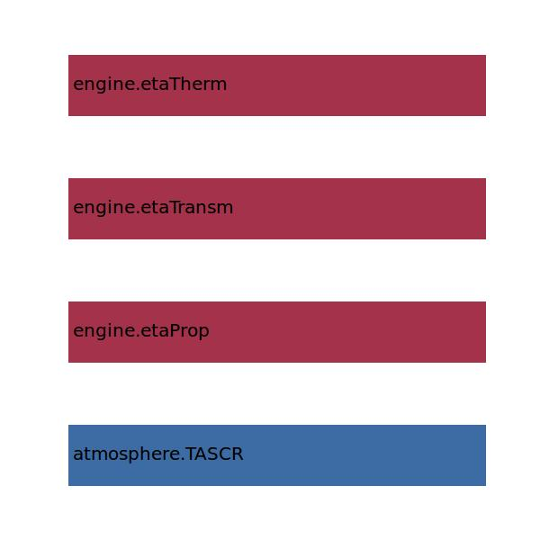
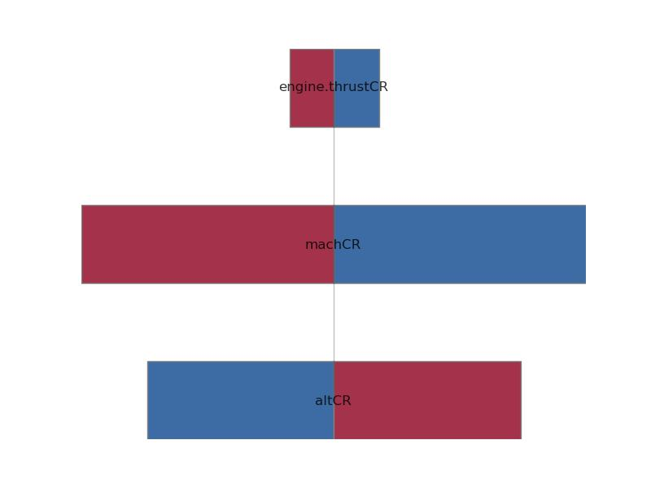
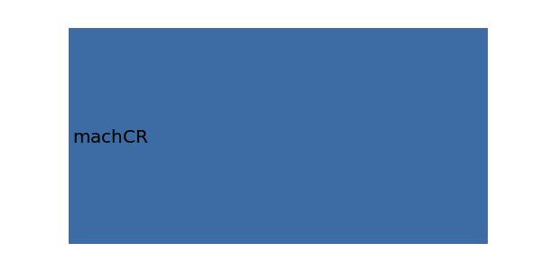

.. _engine.sfcCR:

Parameter: sfcCR
^^^^^^^^^^^^^^^^^^^^^^^^^^^^^^^^^^^^^^^^^^^^^^^^^^^^^^^^

    SFC for cruise condition 
	
    Specific fuel consumption, SFC, is an engineering term 
    that is used to describe the fuel efficiency of an engine 
    design with respect to thrust output. It allows the efficiency 
    of different sized engines to be directly compared.    
	
    :Unit: [kg/h/N]
    :Wiki: http://en.wikipedia.org/wiki/Thrust_specific_fuel_consumption
	

Calculation Methods
"""""""""""""""""""""""""""""""""""""""""""""""""""""""
.. automethod:: VAMPzero.Component.Engine.Propulsion.sfcCR.sfcCR.calc

   :Dependencies: 
   * :ref:`atmosphere.TASCR`
   * :ref:`engine.etaProp`
   * :ref:`engine.etaTransm`
   * :ref:`engine.etaTherm`

   :Sensitivities: 

.. automethod:: VAMPzero.Component.Engine.Propulsion.sfcCR.sfcCR.calcCPACS

   :Dependencies: 
   * :ref:`aircraft.altCR`
   * :ref:`aircraft.machCR`
   * :ref:`engine.thrustCR`

.. automethod:: VAMPzero.Component.Engine.Propulsion.sfcCR.sfcCR.calcEurequa

   :Dependencies: 
   * :ref:`aircraft.altCR`
   * :ref:`aircraft.machCR`
   * :ref:`engine.thrustCR`

   :Sensitivities: 

.. automethod:: VAMPzero.Component.Engine.Propulsion.sfcCR.sfcCR.calcJet

   :Dependencies: 
   * :ref:`engine.bypassRatio`

   :Sensitivities: 

.. automethod:: VAMPzero.Component.Engine.Propulsion.sfcCR.sfcCR.calcOverallEff

   :Dependencies: 
   * :ref:`atmosphere.TASCR`
   * :ref:`engine.etaProp`
   * :ref:`engine.etaTransm`
   * :ref:`engine.etaTherm`

   :Sensitivities: 

.. automethod:: VAMPzero.Component.Engine.Propulsion.sfcCR.sfcCR.calcProp

   :Dependencies: 
   * :ref:`aircraft.machCR`
   * :ref:`engine.thrustCR`

   :Sensitivities: 

CPACS Import
"""""""""""""""""""""""""""""""""""""""""""""""""""""""
.. automethod:: VAMPzero.Component.Engine.Propulsion.sfcCR.sfcCR.cpacsImport

