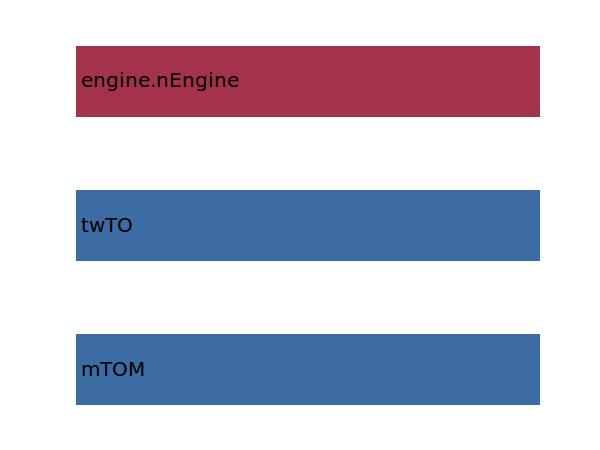
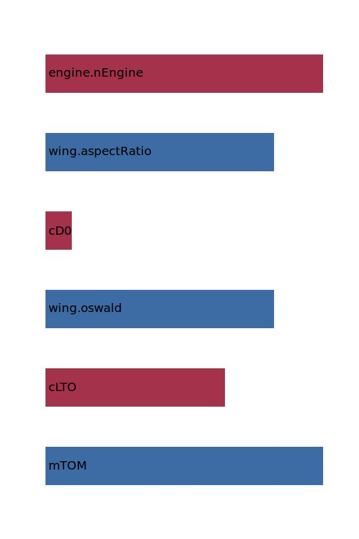
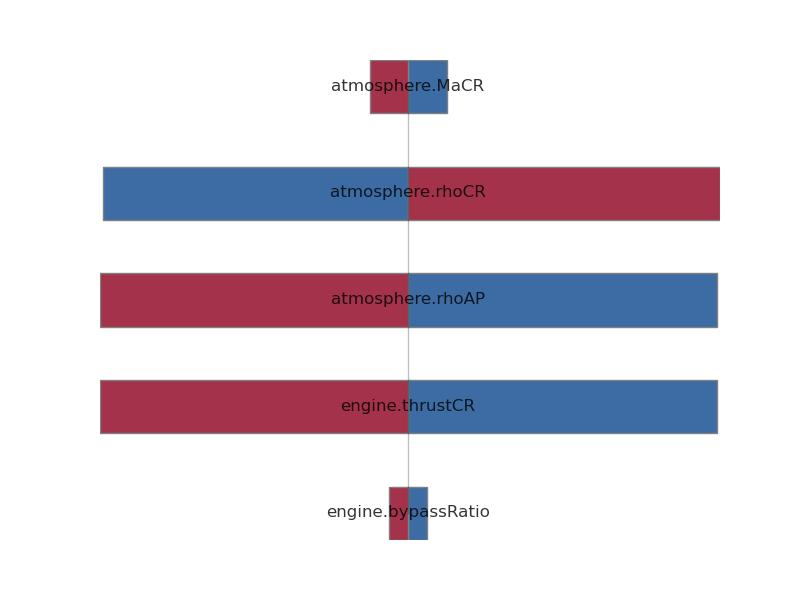

.. _engine.thrustTO:

Parameter: thrustTO
^^^^^^^^^^^^^^^^^^^^^^^^^^^^^^^^^^^^^^^^^^^^^^^^^^^^^^^^

    Takeoff thrust for one engine. Conditions for sea-level, standard day
    
    :Unit: [N]
	

Calculation Methods
"""""""""""""""""""""""""""""""""""""""""""""""""""""""
.. automethod:: VAMPzero.Component.Engine.Propulsion.thrustTO.thrustTO.calc

   :Dependencies: 
   * :ref:`aircraft.mTOM`
   * :ref:`aircraft.twTO`
   * :ref:`engine.nEngine`

   :Sensitivities: 

.. automethod:: VAMPzero.Component.Engine.Propulsion.thrustTO.thrustTO.calcEq

   :Dependencies: 
   * :ref:`aircraft.mTOM`
   * :ref:`aircraft.cLTO`
   * :ref:`wing.oswald`
   * :ref:`aircraft.cD0`
   * :ref:`wing.aspectRatio`
   * :ref:`engine.nEngine`

   :Sensitivities: 

.. automethod:: VAMPzero.Component.Engine.Propulsion.thrustTO.thrustTO.calcThrustCR

   :Dependencies: 
   * :ref:`engine.bypassRatio`
   * :ref:`engine.thrustCR`
   * :ref:`atmosphere.rhoAP`
   * :ref:`atmosphere.rhoCR`
   * :ref:`atmosphere.MaCR`

   :Sensitivities: 

.. automethod:: VAMPzero.Component.Engine.Propulsion.thrustTO.thrustTO.calctwTO

   :Dependencies: 
   * :ref:`aircraft.mTOM`
   * :ref:`aircraft.twTO`
   * :ref:`engine.nEngine`

   :Sensitivities: 

CPACS Import
"""""""""""""""""""""""""""""""""""""""""""""""""""""""
.. automethod:: VAMPzero.Component.Engine.Propulsion.thrustTO.thrustTO.cpacsImport

CPACS Export
-------------------
The values for thrustTO are exported to:

.. code-block:: xml

   <cpacs>
      <vehicles>
         <engines>
            <engine>
               <analysis>
                  <thrust00>

