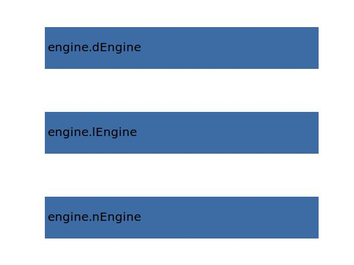

.. _engine.wetArea:

Parameter: wetArea
^^^^^^^^^^^^^^^^^^^^^^^^^^^^^^^^^^^^^^^^^^^^^^^^^^^^^^^^
    
    The wetted area of all engines 
	
    :Unit: [m2]
    :Wiki: http://en.wikipedia.org/wiki/Wetted_area
    

Calculation Methods
"""""""""""""""""""""""""""""""""""""""""""""""""""""""
.. automethod:: VAMPzero.Component.Engine.Geometry.wetArea.wetArea.calc

   :Dependencies: 
   * :ref:`engine.nEngine`
   * :ref:`engine.lEngine`
   * :ref:`engine.dEngine`

   :Sensitivities: 

