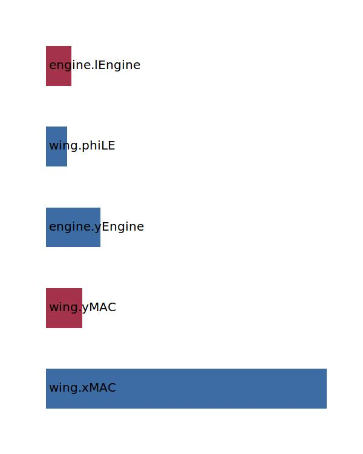

.. _engine.xEngine:

Parameter: xEngine
^^^^^^^^^^^^^^^^^^^^^^^^^^^^^^^^^^^^^^^^^^^^^^^^^^^^^^^^

    X-location of the engine inlet
	
    :Unit: [m]
    

Calculation Methods
"""""""""""""""""""""""""""""""""""""""""""""""""""""""
.. automethod:: VAMPzero.Component.Engine.Geometry.xEngine.xEngine.calc

   :Dependencies: 
   * :ref:`wing.xMAC`
   * :ref:`wing.yMAC`
   * :ref:`engine.yEngine`
   * :ref:`wing.phiLE`
   * :ref:`engine.lEngine`

   :Sensitivities: 

CPACS Import
"""""""""""""""""""""""""""""""""""""""""""""""""""""""
The values for xEngine are imported from:

.. code-block:: xml

   <cpacs>
      <vehicles>
         <aircraft>
            <model>
               <engines>
                  <engine>
                     <transformation>
                        <translation>
                           <x>

CPACS Export
-------------------
The values for xEngine are exported to:

.. code-block:: xml

   <cpacs>
      <vehicles>
         <aircraft>
            <model>
               <engines>
                  <engine>
                     <transformation>
                        <translation>
                           <x>

