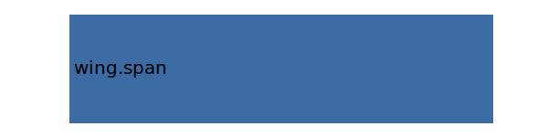

.. _engine.yEngine:

Parameter: yEngine
^^^^^^^^^^^^^^^^^^^^^^^^^^^^^^^^^^^^^^^^^^^^^^^^^^^^^^^^

    Y-location of the engine 
	
    :Unit: [m]
    

Calculation Methods
"""""""""""""""""""""""""""""""""""""""""""""""""""""""
.. automethod:: VAMPzero.Component.Engine.Geometry.yEngine.yEngine.calc

   :Dependencies: 
   * :ref:`wing.span`

   :Sensitivities: 

CPACS Import
"""""""""""""""""""""""""""""""""""""""""""""""""""""""
The values for yEngine are imported from:

.. code-block:: xml

   <cpacs>
      <vehicles>
         <aircraft>
            <model>
               <engines>
                  <engine>
                     <transformation>
                        <translation>
                           <y>

CPACS Export
-------------------
The values for yEngine are exported to:

.. code-block:: xml

   <cpacs>
      <vehicles>
         <aircraft>
            <model>
               <engines>
                  <engine>
                     <transformation>
                        <translation>
                           <y>

