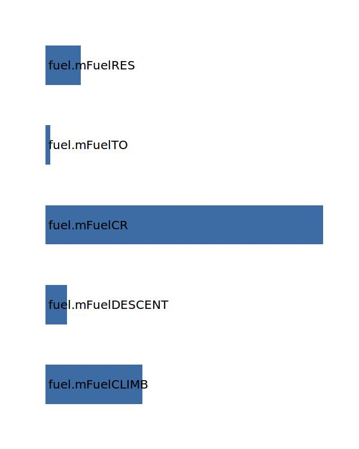
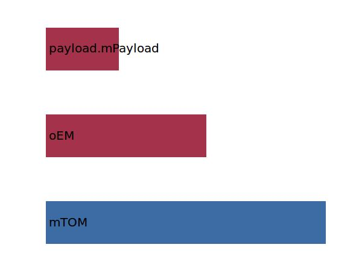
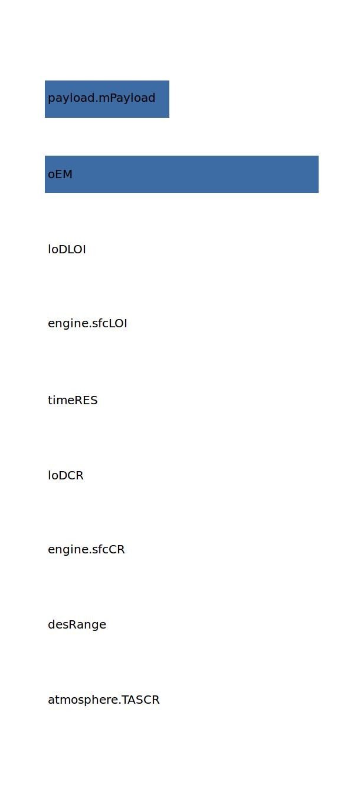
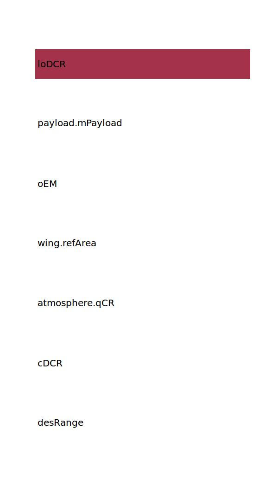

.. _fuel.mFM:

Parameter: mFM
^^^^^^^^^^^^^^^^^^^^^^^^^^^^^^^^^^^^^^^^^^^^^^^^^^^^^^^^

    The complete mission fuel mass 
    
    :Unit: [kg]
    

Calculation Methods
"""""""""""""""""""""""""""""""""""""""""""""""""""""""
.. automethod:: VAMPzero.Component.Fuel.Mass.mFM.mFM.calc

   :Dependencies: 
   * :ref:`fuel.mFuelCLIMB`
   * :ref:`fuel.mFuelDESCENT`
   * :ref:`fuel.mFuelCR`
   * :ref:`fuel.mFuelTO`
   * :ref:`fuel.mFuelRES`

   :Sensitivities: 

.. automethod:: VAMPzero.Component.Fuel.Mass.mFM.mFM.calcMass

   :Dependencies: 
   * :ref:`aircraft.mTOM`
   * :ref:`aircraft.oEM`
   * :ref:`payload.mPayload`

   :Sensitivities: 

.. automethod:: VAMPzero.Component.Fuel.Mass.mFM.mFM.calcRaymer

   :Dependencies: 
   * :ref:`atmosphere.TASCR`
   * :ref:`aircraft.desRange`
   * :ref:`engine.sfcCR`
   * :ref:`aircraft.loDCR`
   * :ref:`aircraft.timeRES`
   * :ref:`engine.sfcLOI`
   * :ref:`aircraft.loDLOI`
   * :ref:`aircraft.oEM`
   * :ref:`payload.mPayload`

   :Sensitivities: 

.. automethod:: VAMPzero.Component.Fuel.Mass.mFM.mFM.calcSum

   :Dependencies: 
   * :ref:`fuel.mFuelCLIMB`
   * :ref:`fuel.mFuelDESCENT`
   * :ref:`fuel.mFuelCR`
   * :ref:`fuel.mFuelTO`
   * :ref:`fuel.mFuelRES`

   :Sensitivities: 

.. automethod:: VAMPzero.Component.Fuel.Mass.mFM.mFM.calcViaRange

   :Dependencies: 
   * :ref:`aircraft.desRange`
   * :ref:`aircraft.cDCR`
   * :ref:`atmosphere.qCR`
   * :ref:`wing.refArea`
   * :ref:`aircraft.oEM`
   * :ref:`payload.mPayload`
   * :ref:`aircraft.loDCR`

   :Sensitivities: 

CPACS Import
"""""""""""""""""""""""""""""""""""""""""""""""""""""""
The values for mFM are imported from:

.. code-block:: xml

   <cpacs>
      <vehicles>
         <aircraft>
            <model>
               <analyses>
                  <massBreakdown>
                     <fuel>
                        <massDescription>
                           <mass>

CPACS Export
-------------------
The values for mFM are exported to:

.. code-block:: xml

   <cpacs>
      <vehicles>
         <aircraft>
            <model>
               <analyses>
                  <massBreakdown>
                     <fuel>
                        <massDescription>
                           <mass>

