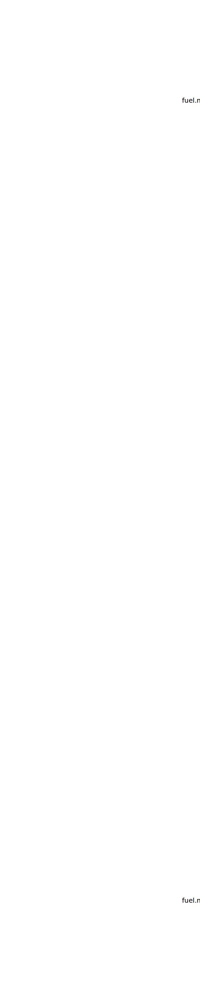

.. _fuel.mFuelRES:

Parameter: mFuelRES
^^^^^^^^^^^^^^^^^^^^^^^^^^^^^^^^^^^^^^^^^^^^^^^^^^^^^^^^

    The fuel used in the reserve segment
    
    :Unit: [kg]
    

Calculation Methods
"""""""""""""""""""""""""""""""""""""""""""""""""""""""
.. automethod:: VAMPzero.Component.Fuel.Mass.mFuelRES.mFuelRES.calc

   :Dependencies: 
   * :ref:`fuel.mFuelCLIMB`
   * :ref:`fuel.mFuelCR`
   * :ref:`fuel.mFuelTO`
   * :ref:`fuel.mFuelDESCENT`
   * :ref:`fuel.mFM`
   * :ref:`engine.sfcCR`
   * :ref:`atmosphere.qCR`
   * :ref:`atmosphere.rhoCR`
   * :ref:`atmosphere.rhoFL1500`
   * :ref:`atmosphere.sigmaFL1500`
   * :ref:`atmosphere.TASCR`
   * :ref:`aircraft.IASCLIMB`
   * :ref:`aircraft.timeCLIMB`
   * :ref:`aircraft.gammaCLIMB`
   * :ref:`aircraft.cD0`
   * :ref:`aircraft.oswald`
   * :ref:`wing.refArea`
   * :ref:`wing.aspectRatio`
   * :ref:`aircraft.oEM`
   * :ref:`payload.mPayload`

   :Sensitivities: 

