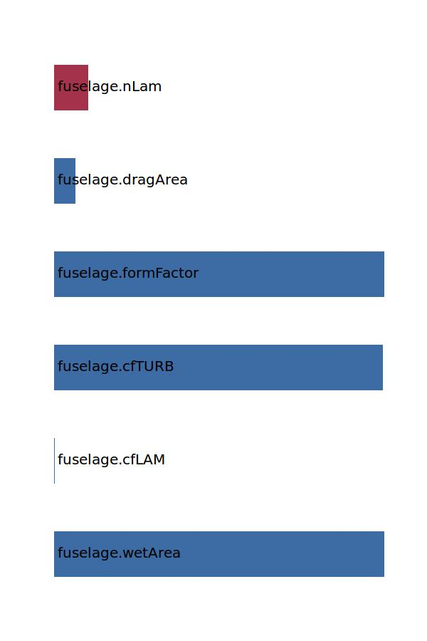

.. _fuselage.cD0c:

Parameter: cD0c
^^^^^^^^^^^^^^^^^^^^^^^^^^^^^^^^^^^^^^^^^^^^^^^^^^^^^^^^

    Component zero lift drag coefficient of the fuselage
    
    :Unit: [ ]
    :Wiki: http://en.wikipedia.org/wiki/Drag_coefficient
    

Calculation Methods
"""""""""""""""""""""""""""""""""""""""""""""""""""""""
.. automethod:: VAMPzero.Component.Fuselage.Aerodynamic.cD0c.cD0c.calc

   :Dependencies: 
   * :ref:`fuselage.wetArea`
   * :ref:`fuselage.cfLAM`
   * :ref:`fuselage.cfTURB`
   * :ref:`fuselage.formFactor`
   * :ref:`fuselage.dragArea`
   * :ref:`fuselage.nLam`

   :Sensitivities: 

