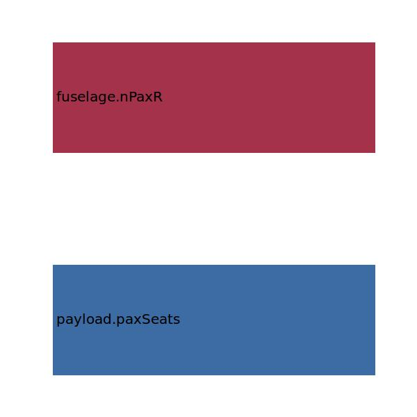

.. _fuselage.lcabin:

Parameter: lcabin
^^^^^^^^^^^^^^^^^^^^^^^^^^^^^^^^^^^^^^^^^^^^^^^^^^^^^^^^

    The length of the cabin section
    
    :Unit: [m] 
    

Calculation Methods
"""""""""""""""""""""""""""""""""""""""""""""""""""""""
.. automethod:: VAMPzero.Component.Fuselage.Geometry.lcabin.lcabin.calc

   :Dependencies: 
   * :ref:`payload.paxSeats`
   * :ref:`fuselage.nPaxR`
   * :ref:`fuselage.nClasses`
   * :ref:`aircraft.rangeType`

   :Sensitivities: 

.. automethod:: VAMPzero.Component.Fuselage.Geometry.lcabin.lcabin.calcLfus

   :Dependencies: 
   * :ref:`fuselage.lfus`
   * :ref:`fuselage.ltail`
   * :ref:`fuselage.loverlay`
   * :ref:`fuselage.lcockpit`

   :Sensitivities: 
.. image:: calcLfus.jpg 
   :width: 80% 

.. automethod:: VAMPzero.Component.Fuselage.Geometry.lcabin.lcabin.calcPax

   :Dependencies: 
   * :ref:`payload.paxSeats`
   * :ref:`fuselage.nPaxR`
   * :ref:`fuselage.nClasses`
   * :ref:`aircraft.rangeType`

   :Sensitivities: 
.. image:: calcPax.jpg 
   :width: 80% 

