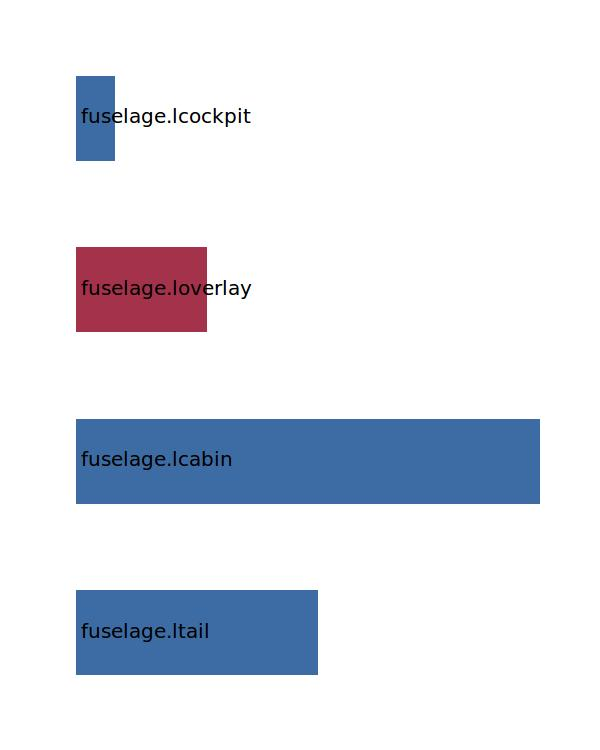

.. _fuselage.lfus:

Parameter: lfus
^^^^^^^^^^^^^^^^^^^^^^^^^^^^^^^^^^^^^^^^^^^^^^^^^^^^^^^^

    fuselage length  
    

Calculation Methods
"""""""""""""""""""""""""""""""""""""""""""""""""""""""
.. automethod:: VAMPzero.Component.Fuselage.Geometry.lfus.lfus.calc

   :Dependencies: 
   * :ref:`fuselage.lnose`
   * :ref:`fuselage.ltail`
   * :ref:`fuselage.lcabin`
   * :ref:`fuselage.loverlay`
   * :ref:`fuselage.lcockpit`

   :Sensitivities: 

CPACS Import
"""""""""""""""""""""""""""""""""""""""""""""""""""""""
.. automethod:: VAMPzero.Component.Fuselage.Geometry.lfus.lfus.cpacsImport

