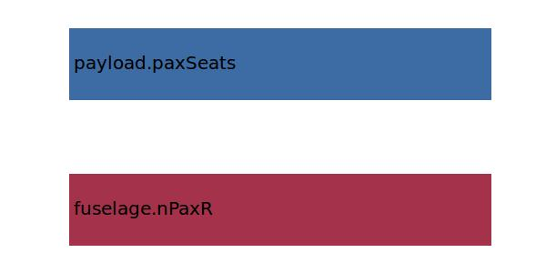

.. _fuselage.nRow:

Parameter: nRow
^^^^^^^^^^^^^^^^^^^^^^^^^^^^^^^^^^^^^^^^^^^^^^^^^^^^^^^^

    The number of seat rows in the cabin
    
    :Unit: [ ] 
    

Calculation Methods
"""""""""""""""""""""""""""""""""""""""""""""""""""""""
.. automethod:: VAMPzero.Component.Fuselage.Cabin.nRow.nRow.calc

   :Dependencies: 
   * :ref:`fuselage.nPaxR`
   * :ref:`payload.paxSeats`

   :Sensitivities: 

