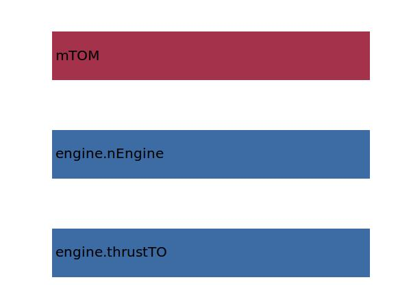

.. _htp.cHT:

Parameter: cHT
^^^^^^^^^^^^^^^^^^^^^^^^^^^^^^^^^^^^^^^^^^^^^^^^^^^^^^^^

    The horizontal tail volume coefficient used to calculate the refArea of the tailplane
    
    :Unit: [ ]
    

Calculation Methods
"""""""""""""""""""""""""""""""""""""""""""""""""""""""
.. automethod:: VAMPzero.Component.Htp.Geometry.cHT.cHT.calc

   :Dependencies: 
   * :ref:`engine.thrustTO`
   * :ref:`engine.nEngine`
   * :ref:`aircraft.mTOM`

   :Sensitivities: 

