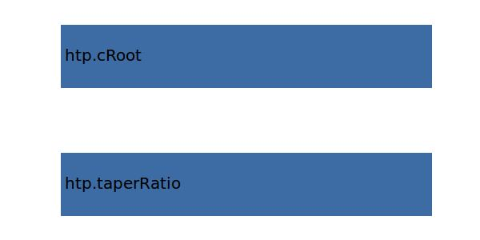

.. _htp.cTip:

Parameter: cTip
^^^^^^^^^^^^^^^^^^^^^^^^^^^^^^^^^^^^^^^^^^^^^^^^^^^^^^^^

    The tip chord of the wing
    
    :Unit: [m]
    

Calculation Methods
"""""""""""""""""""""""""""""""""""""""""""""""""""""""
.. automethod:: VAMPzero.Component.Wing.Geometry.cTip.cTip.calc

   :Dependencies: 
   * :ref:`htp.taperRatio`
   * :ref:`htp.cRoot`

   :Sensitivities: 

