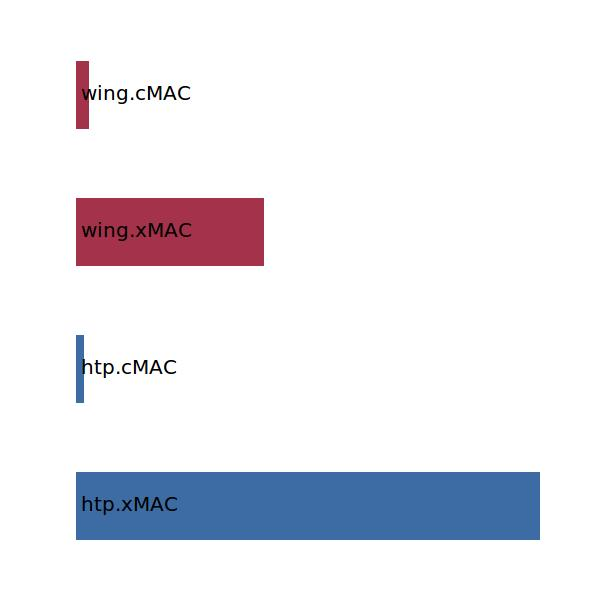

.. _htp.lHT:

Parameter: lHT
^^^^^^^^^^^^^^^^^^^^^^^^^^^^^^^^^^^^^^^^^^^^^^^^^^^^^^^^

    The lever for the horizontal tail
    
    :Unit: [m] 
    

Calculation Methods
"""""""""""""""""""""""""""""""""""""""""""""""""""""""
.. automethod:: VAMPzero.Component.Htp.Geometry.lHT.lHT.calc

   :Dependencies: 
   * :ref:`htp.xMAC`
   * :ref:`htp.cMAC`
   * :ref:`wing.xMAC`
   * :ref:`wing.cMAC`

   :Sensitivities: 

