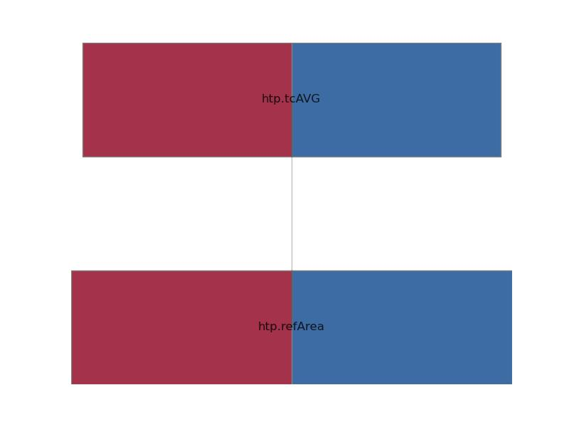

.. _htp.mHtp:

Parameter: mHtp
^^^^^^^^^^^^^^^^^^^^^^^^^^^^^^^^^^^^^^^^^^^^^^^^^^^^^^^^

    The horizontal tail plane (HTP) mass definition equals the Airbus weight chapter 13. The HTP mass includes the complete HTP structure from tip to tip, broken down as follows:
    
    * torsion box (skins, spars, ribs, sealants, fuselage attachment)
    * leading edge (skins, ribs, panes)
    * fixed trailing edge (panels, ribs, hinge and actuator fittings)
    * elevators (complete elevator body, hinge and actuator fittings)
    * tips and fairings (tips, fairing supports and fairings)
    * miscellaneous (external paint final coat, HTP-fuselage bolts, torsion box-leading edge and torsion box-trailing edge bolts )
    
    The HTP mass excludes systems (e.g. actuators) but fittings on which e.g. the actuators are fixed are included into wing mass but not the bolts that are used for fixing the actuator.
    
    The difference between the DIN 9020 (which is normally used within LTH) and the Airbus definition is small. In the DIN 9020 definition actuator fittings are excluded in the HTP structure weight but therefore flutter dampers are included into the HTP structural weight. The HTP weight difference of the Fokker F100 is <2% between the two weight breakdowns.
    
    :Unit: [kg]
    

Calculation Methods
"""""""""""""""""""""""""""""""""""""""""""""""""""""""
.. automethod:: VAMPzero.Component.Htp.Mass.mHtp.mHtp.calc

   :Dependencies: 
   * :ref:`htp.refArea`
   * :ref:`htp.tcAVG`

   :Sensitivities: 

.. automethod:: VAMPzero.Component.Htp.Mass.mHtp.mHtp.calcDorbathPraktikum

   :Dependencies: 
   * :ref:`htp.refArea`
   * :ref:`htp.tcAVG`

   :Sensitivities: 

CPACS Import
"""""""""""""""""""""""""""""""""""""""""""""""""""""""
The values for mHtp are imported from:

.. code-block:: xml

   <cpacs>
      <vehicles>
         <aircraft>
            <model>
               <analyses>
                  <massBreakdown>
                     <mOEM>
                        <mEM>
                           <mStructure>
                              <mWingsStructure>
                                 <mWingStructure[2]>
                                    <massDescription>
                                       <mass>

CPACS Export
-------------------
The values for mHtp are exported to:

.. code-block:: xml

   <cpacs>
      <vehicles>
         <aircraft>
            <model>
               <analyses>
                  <massBreakdown>
                     <mOEM>
                        <mEM>
                           <mStructure>
                              <mWingsStructure>
                                 <mWingStructure[2]>
                                    <massDescription>
                                       <mass>

