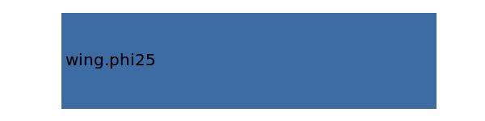

.. _htp.phi25:

Parameter: phi25
^^^^^^^^^^^^^^^^^^^^^^^^^^^^^^^^^^^^^^^^^^^^^^^^^^^^^^^^

    The quarter chord sweep angle of the horizontal tail  
    
    :Unit: [deg]
    

Calculation Methods
"""""""""""""""""""""""""""""""""""""""""""""""""""""""
.. automethod:: VAMPzero.Component.Htp.Geometry.phi25.phi25.calc

   :Dependencies: 
   * :ref:`wing.phi25`

   :Sensitivities: 

CPACS Import
"""""""""""""""""""""""""""""""""""""""""""""""""""""""
.. automethod:: VAMPzero.Component.Htp.Geometry.phi25.phi25.cpacsImport

