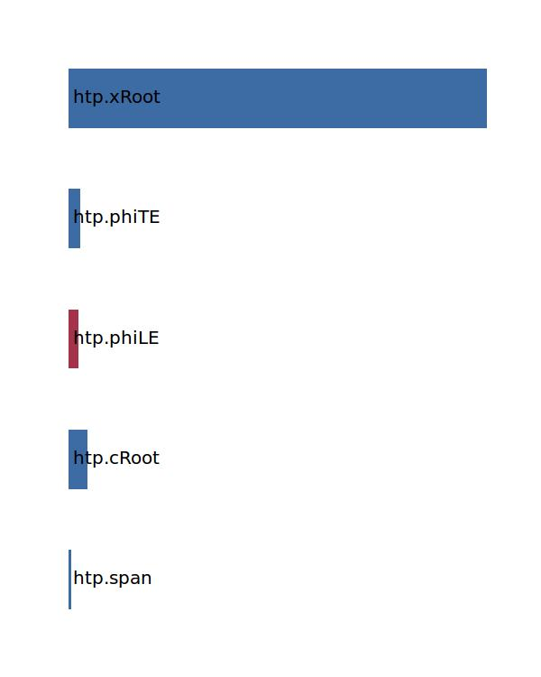

.. _htp.posCoG:

Parameter: posCoG
^^^^^^^^^^^^^^^^^^^^^^^^^^^^^^^^^^^^^^^^^^^^^^^^^^^^^^^^

    The x position of the horizontal tailplane's  center of gravity
    
    :Unit: [m] 
    

Calculation Methods
"""""""""""""""""""""""""""""""""""""""""""""""""""""""
.. automethod:: VAMPzero.Component.Htp.CoG.posCoG.posCoG.calc

   :Dependencies: 
   * :ref:`htp.span`
   * :ref:`htp.cRoot`
   * :ref:`htp.phiLE`
   * :ref:`htp.phiTE`
   * :ref:`htp.xRoot`

   :Sensitivities: 

CPACS Import
"""""""""""""""""""""""""""""""""""""""""""""""""""""""
The values for posCoG are imported from:

.. code-block:: xml

   <cpacs>
      <vehicles>
         <aircraft>
            <model>
               <analyses>
                  <massBreakdown>
                     <mOEM>
                        <mEM>
                           <mStructure>
                              <mWingsStructure>
                                 <mWingStructure[2]>
                                    <massDescription>
                                       <location>
                                          <x>

CPACS Export
-------------------
The values for posCoG are exported to:

.. code-block:: xml

   <cpacs>
      <vehicles>
         <aircraft>
            <model>
               <analyses>
                  <massBreakdown>
                     <mOEM>
                        <mEM>
                           <mStructure>
                              <mWingsStructure>
                                 <mWingStructure[2]>
                                    <massDescription>
                                       <location>
                                          <x>

