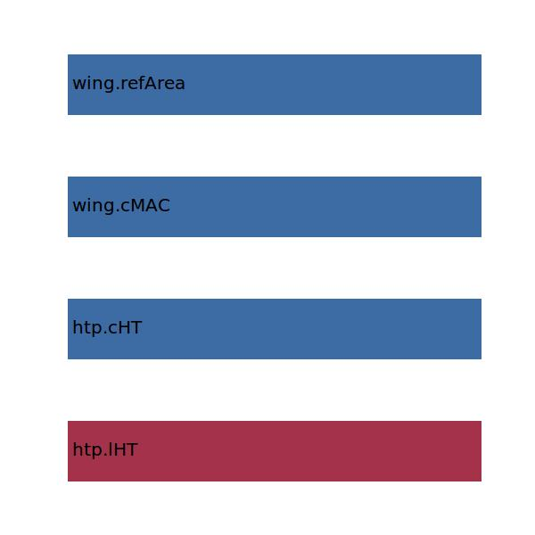

.. _htp.refArea:

Parameter: refArea
^^^^^^^^^^^^^^^^^^^^^^^^^^^^^^^^^^^^^^^^^^^^^^^^^^^^^^^^

    The reference area of the horizontal tailplane
    
    :Unit: [m2] 
    

Calculation Methods
"""""""""""""""""""""""""""""""""""""""""""""""""""""""
.. automethod:: VAMPzero.Component.Htp.Geometry.refArea.refArea.calc

   :Dependencies: 
   * :ref:`htp.lHT`
   * :ref:`htp.cHT`
   * :ref:`wing.cMAC`
   * :ref:`wing.refArea`

   :Sensitivities: 

CPACS Import
"""""""""""""""""""""""""""""""""""""""""""""""""""""""
.. automethod:: VAMPzero.Component.Htp.Geometry.refArea.refArea.cpacsImport

