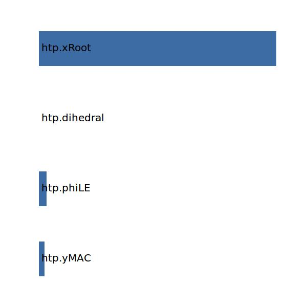

.. _htp.xMAC:

Parameter: xMAC
^^^^^^^^^^^^^^^^^^^^^^^^^^^^^^^^^^^^^^^^^^^^^^^^^^^^^^^^

    The x position of the mean aerodynamic chord of the horizontail tailplane
    
    :Unit: [m]
    

Calculation Methods
"""""""""""""""""""""""""""""""""""""""""""""""""""""""
.. automethod:: VAMPzero.Component.Htp.Geometry.xMAC.xMAC.calc

   :Dependencies: 
   * :ref:`htp.yMAC`
   * :ref:`htp.phiLE`
   * :ref:`htp.dihedral`
   * :ref:`htp.xRoot`

   :Sensitivities: 

