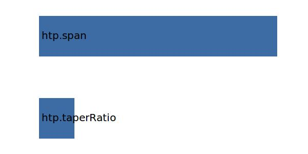

.. _htp.yMAC:

Parameter: yMAC
^^^^^^^^^^^^^^^^^^^^^^^^^^^^^^^^^^^^^^^^^^^^^^^^^^^^^^^^

    The wing's mean aerodynamic chord's y location in absolute coordintes
    
    :Unit: [m]
    

Calculation Methods
"""""""""""""""""""""""""""""""""""""""""""""""""""""""
.. automethod:: VAMPzero.Component.Wing.Geometry.yMAC.yMAC.calc

   :Dependencies: 
   * :ref:`htp.taperRatio`
   * :ref:`htp.span`

   :Sensitivities: 

