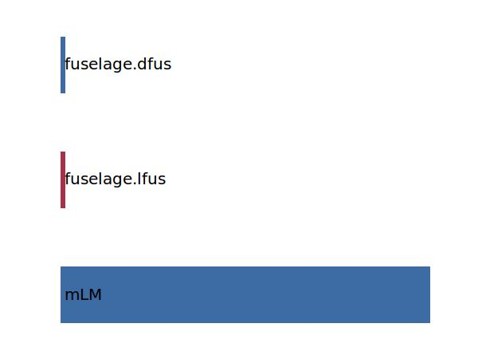

.. _landingGear.mLandingGear:

Parameter: mLandingGear
^^^^^^^^^^^^^^^^^^^^^^^^^^^^^^^^^^^^^^^^^^^^^^^^^^^^^^^^

    The landing gear mass definition equals the Airbus weight chapter 15. 
    The landing gear mass includes all landing gears (nose, center and wing landing gears). 
    The formula below is only valid for aircraft having no or one center landing gear. 
    The mass definition is broken down as follows:
    
    * structure (incl. main structure, front and rear pintle pins, upper and lower cardan pins, shock absorber, lock and retraction actuators, fluids in actuators)
    * wheels, brakes and tires
    * miscellaneous (brake system equipment, uplock box, system hydraulic fluids, torque link damper, tachometer, kneeling system equipment, remote data concentrators)
    
    The main differences between the DIN 9020 (which is normally used within LTH) 
    and the Airbus definition is that the wing/fuselage attachment fittings 
    are accounted within the wing/fuselage chapter according to the Airbus definition, but 
    are accounted with the landing gear according to DIN 9020.
    
    For the Fokker F 100 the landing gear weight is ~17% lighter according to 
    the Airbus definition compared with the DIN 9020 definition.
    

Calculation Methods
"""""""""""""""""""""""""""""""""""""""""""""""""""""""
.. automethod:: VAMPzero.Component.LandingGear.Mass.mLandingGear.mLandingGear.calc

   :Dependencies: 
   * :ref:`aircraft.mLM`
   * :ref:`fuselage.lfus`
   * :ref:`fuselage.dfus`

   :Sensitivities: 

.. automethod:: VAMPzero.Component.LandingGear.Mass.mLandingGear.mLandingGear.calcDorbathPraktikum

   :Dependencies: 
   * :ref:`aircraft.mTOM`

   :Sensitivities: 

CPACS Import
"""""""""""""""""""""""""""""""""""""""""""""""""""""""
.. automethod:: VAMPzero.Component.LandingGear.Mass.mLandingGear.mLandingGear.cpacsImport

CPACS Export
-------------------
The values for mLandingGear are exported to:

.. code-block:: xml

   <cpacs>
      <vehicles>
         <aircraft>
            <model>
               <analyses>
                  <massBreakdown>
                     <mOEM>
                        <mEM>
                           <mStructure>
                              <mLandingGears>
                                 <massDescription>
                                    <mass>

