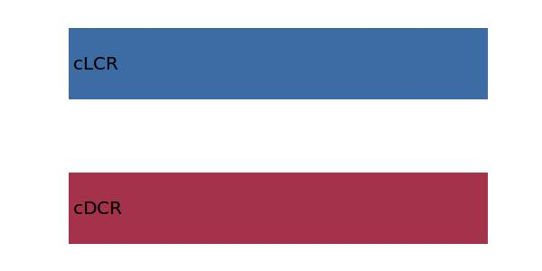

.. _aircraft.loDCR:

Parameter: loDCR
^^^^^^^^^^^^^^^^^^^^^^^^^^^^^^^^^^^^^^^^^^^^^^^^^^^^^^^^

    The lift over drag ratio for the cruise condition
    
    In aerodynamics, the lift-to-drag ratio, or L/D 
    ratio ("ell-over-dee"), is the amount of lift generated 
    by a wing or vehicle, divided by the drag it creates by 
    moving through the air. 
    
    :Wiki: http://en.wikipedia.org/wiki/Lift-to-drag_ratio
    :Unit: [ ]
    

Calculation Methods
"""""""""""""""""""""""""""""""""""""""""""""""""""""""
.. automethod:: VAMPzero.Component.Main.Aerodynamic.loDCR.loDCR.calc

   :Dependencies: 
   * :ref:`aircraft.cDCR`
   * :ref:`aircraft.cLCR`

   :Sensitivities: 

