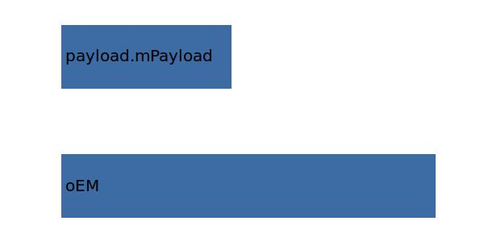

.. _aircraft.mZFW:

Parameter: mZFW
^^^^^^^^^^^^^^^^^^^^^^^^^^^^^^^^^^^^^^^^^^^^^^^^^^^^^^^^

    The maximum zero fuel weight for the aircraft
    
    :Unit: [kg] 
    

Calculation Methods
"""""""""""""""""""""""""""""""""""""""""""""""""""""""
.. automethod:: VAMPzero.Component.Main.Mass.mZFW.mZFW.calc

   :Dependencies: 
   * :ref:`aircraft.oEM`
   * :ref:`payload.mPayload`

   :Sensitivities: 

CPACS Import
"""""""""""""""""""""""""""""""""""""""""""""""""""""""
The values for mZFW are imported from:

.. code-block:: xml

   <cpacs>
      <vehicles>
         <aircraft>
            <model>
               <analyses>
                  <massBreakdown>
                     <designMasses>
                        <mZFM>
                           <mass>

CPACS Export
-------------------
The values for mZFW are exported to:

.. code-block:: xml

   <cpacs>
      <vehicles>
         <aircraft>
            <model>
               <analyses>
                  <massBreakdown>
                     <designMasses>
                        <mZFM>
                           <mass>

