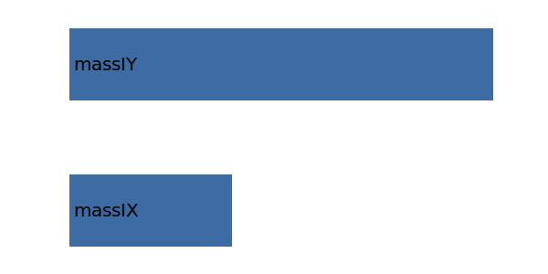

.. _aircraft.massIZ:

Parameter: massIZ
^^^^^^^^^^^^^^^^^^^^^^^^^^^^^^^^^^^^^^^^^^^^^^^^^^^^^^^^

    The mass moment of inertia along the z-axis 
    
    :Unit: 'kgm2'
    :Wiki: http://en.wikipedia.org/wiki/Moment_of_inertia
    

Calculation Methods
"""""""""""""""""""""""""""""""""""""""""""""""""""""""
.. automethod:: VAMPzero.Component.Main.Inertia.massIZ.massIZ.calc

   :Dependencies: 
   * :ref:`aircraft.massIX`
   * :ref:`aircraft.massIY`

   :Sensitivities: 

CPACS Import
"""""""""""""""""""""""""""""""""""""""""""""""""""""""
The values for massIZ are imported from:

.. code-block:: xml

   <cpacs>
      <vehicles>
         <aircraft>
            <model>
               <analyses>
                  <massBreakdown>
                     <designMasses>
                        <mTOM>
                           <massInertia>
                              <Jzz>

CPACS Export
-------------------
The values for massIZ are exported to:

.. code-block:: xml

   <cpacs>
      <vehicles>
         <aircraft>
            <model>
               <analyses>
                  <massBreakdown>
                     <designMasses>
                        <mTOM>
                           <massInertia>
                              <Jzz>

