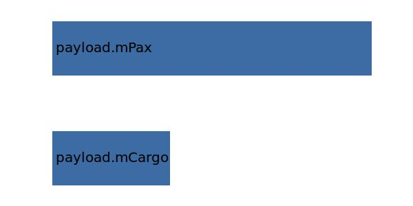

.. _payload.mPayload:

Parameter: mPayload
^^^^^^^^^^^^^^^^^^^^^^^^^^^^^^^^^^^^^^^^^^^^^^^^^^^^^^^^

    The payload mass consisiting of cargo and passengers and passenger luggage
    
    :Unit: [kg] 
    

Calculation Methods
"""""""""""""""""""""""""""""""""""""""""""""""""""""""
.. automethod:: VAMPzero.Component.Payload.Mass.mPayload.mPayload.calc

   :Dependencies: 
   * :ref:`payload.mCargo`
   * :ref:`payload.mPax`

   :Sensitivities: 

CPACS Import
"""""""""""""""""""""""""""""""""""""""""""""""""""""""
The values for mPayload are imported from:

.. code-block:: xml

   <cpacs>
      <vehicles>
         <aircraft>
            <model>
               <analyses>
                  <massBreakdown>
                     <payload>
                        <massDescription>
                           <mass>

CPACS Export
-------------------
The values for mPayload are exported to:

.. code-block:: xml

   <cpacs>
      <vehicles>
         <aircraft>
            <model>
               <analyses>
                  <massBreakdown>
                     <payload>
                        <massDescription>
                           <mass>

