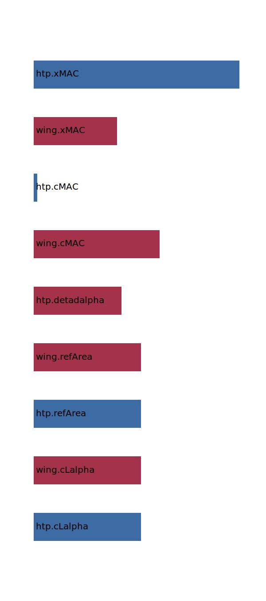

.. _aircraft.posNP:

Parameter: posNP
^^^^^^^^^^^^^^^^^^^^^^^^^^^^^^^^^^^^^^^^^^^^^^^^^^^^^^^^

    The x-position of the neutral point relative to cMAC
    
    :Unit: [ ]
    

Calculation Methods
"""""""""""""""""""""""""""""""""""""""""""""""""""""""
.. automethod:: VAMPzero.Component.Main.CoG.posNP.posNP.calc

   :Dependencies: 
   * :ref:`htp.cLalpha`
   * :ref:`wing.cLalpha`
   * :ref:`htp.refArea`
   * :ref:`wing.refArea`
   * :ref:`htp.detadalpha`
   * :ref:`wing.cMAC`
   * :ref:`htp.cMAC`
   * :ref:`wing.xMAC`
   * :ref:`htp.xMAC`

   :Sensitivities: 

