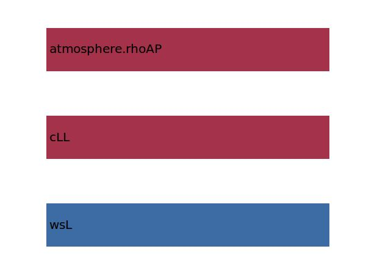

.. _aircraft.sLFL:

Parameter: sLFL
^^^^^^^^^^^^^^^^^^^^^^^^^^^^^^^^^^^^^^^^^^^^^^^^^^^^^^^^

    The landing field length
    
    :Unit: [m] 
    

Calculation Methods
"""""""""""""""""""""""""""""""""""""""""""""""""""""""
.. automethod:: VAMPzero.Component.Main.Performance.sLFL.sLFL.calc

   :Dependencies: 
   * :ref:`aircraft.wsL`
   * :ref:`aircraft.cLL`
   * :ref:`atmosphere.rhoAP`

   :Sensitivities: 

