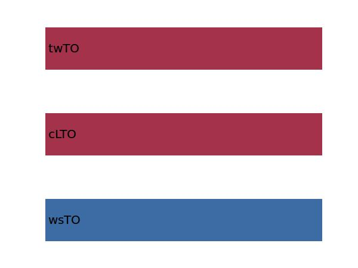

.. _aircraft.sTOFL:

Parameter: sTOFL
^^^^^^^^^^^^^^^^^^^^^^^^^^^^^^^^^^^^^^^^^^^^^^^^^^^^^^^^

    The take-off field length 
    
    :Unit: [m]
    

Calculation Methods
"""""""""""""""""""""""""""""""""""""""""""""""""""""""
.. automethod:: VAMPzero.Component.Main.Performance.sTOFL.sTOFL.calc

   :Dependencies: 
   * :ref:`aircraft.wsTO`
   * :ref:`aircraft.cLTO`
   * :ref:`aircraft.twTO`

   :Sensitivities: 

