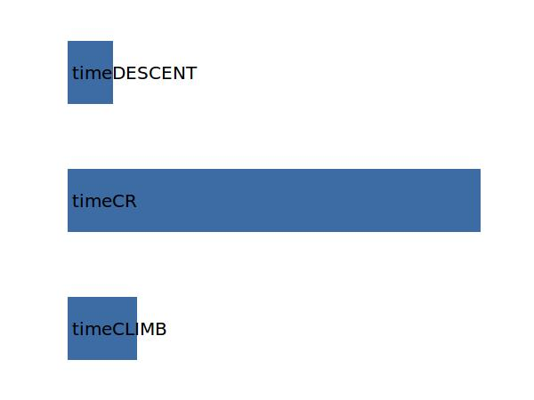

.. _aircraft.tBlock:

Parameter: tBlock
^^^^^^^^^^^^^^^^^^^^^^^^^^^^^^^^^^^^^^^^^^^^^^^^^^^^^^^^

    The block time for the design mission
    
    :Unit: [h]
    

Calculation Methods
"""""""""""""""""""""""""""""""""""""""""""""""""""""""
.. automethod:: VAMPzero.Component.Main.DOC.tBlock.tBlock.calc

   :Dependencies: 
   * :ref:`aircraft.timeCLIMB`
   * :ref:`aircraft.timeCR`
   * :ref:`aircraft.timeDESCENT`

   :Sensitivities: 

