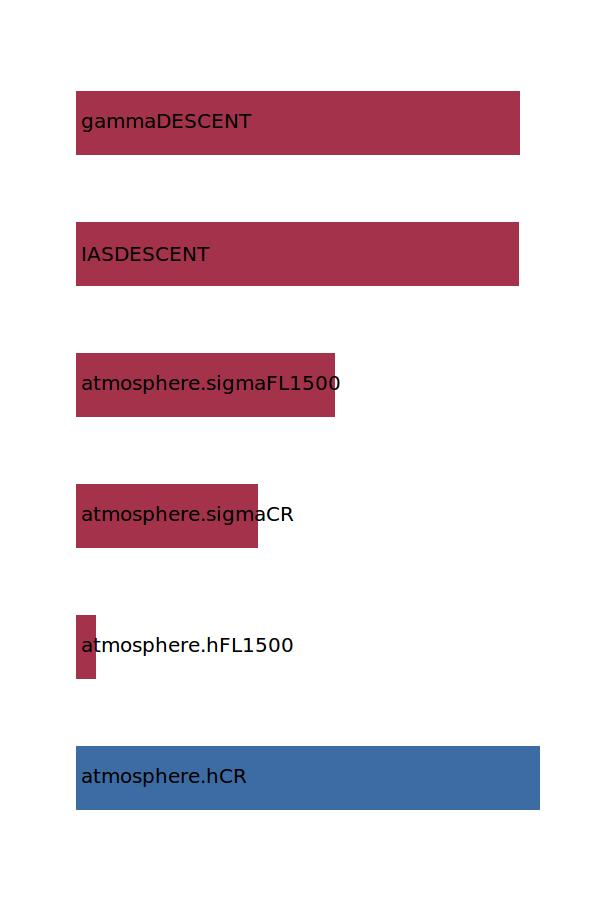

.. _aircraft.timeDESCENT:

Parameter: timeDESCENT
^^^^^^^^^^^^^^^^^^^^^^^^^^^^^^^^^^^^^^^^^^^^^^^^^^^^^^^^

    The time in the descent segment
    
    :Unit: [s] 
    

Calculation Methods
"""""""""""""""""""""""""""""""""""""""""""""""""""""""
.. automethod:: VAMPzero.Component.Main.Performance.timeDESCENT.timeDESCENT.calc

   :Dependencies: 
   * :ref:`atmosphere.hCR`
   * :ref:`atmosphere.hFL1500`
   * :ref:`atmosphere.sigmaCR`
   * :ref:`atmosphere.sigmaFL1500`
   * :ref:`aircraft.IASDESCENT`
   * :ref:`aircraft.gammaDESCENT`

   :Sensitivities: 

