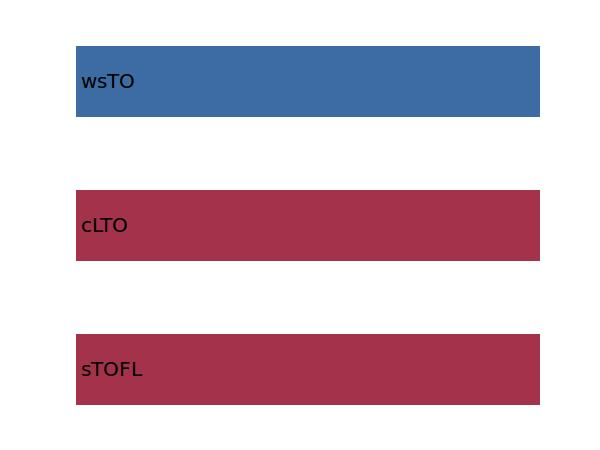
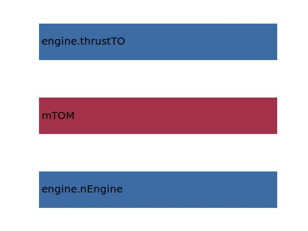

.. _aircraft.twTO:

Parameter: twTO
^^^^^^^^^^^^^^^^^^^^^^^^^^^^^^^^^^^^^^^^^^^^^^^^^^^^^^^^

    The thrust to weight ratio for take-off
    
    :Unit: [kg/m2]
    :Wiki: http://en.wikipedia.org/wiki/Thrust-to-weight_ratio
    

Calculation Methods
"""""""""""""""""""""""""""""""""""""""""""""""""""""""
.. automethod:: VAMPzero.Component.Main.Sizing.twTO.twTO.calc

   :Dependencies: 
   * :ref:`aircraft.sTOFL`
   * :ref:`aircraft.cLTO`
   * :ref:`aircraft.wsTO`

   :Sensitivities: 

.. automethod:: VAMPzero.Component.Main.Sizing.twTO.twTO.calcThrustTO

   :Dependencies: 
   * :ref:`engine.nEngine`
   * :ref:`aircraft.mTOM`
   * :ref:`engine.thrustTO`

   :Sensitivities: 

.. automethod:: VAMPzero.Component.Main.Sizing.twTO.twTO.calcsTOFL

   :Dependencies: 
   * :ref:`aircraft.sTOFL`
   * :ref:`aircraft.cLTO`
   * :ref:`aircraft.wsTO`

   :Sensitivities: 

