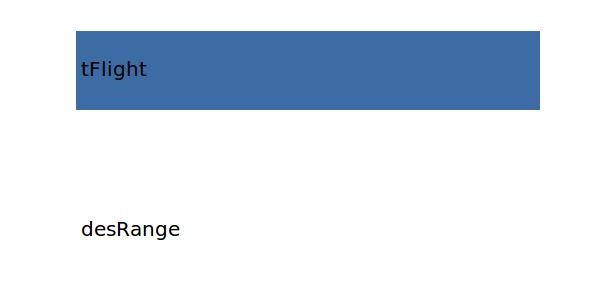

.. _aircraft.utilization:

Parameter: utilization
^^^^^^^^^^^^^^^^^^^^^^^^^^^^^^^^^^^^^^^^^^^^^^^^^^^^^^^^

    The annual utilization  defines the number of flight hours relative to the number of possible flight hours
     
    :Unit: [h/a]
    

Calculation Methods
"""""""""""""""""""""""""""""""""""""""""""""""""""""""
.. automethod:: VAMPzero.Component.Main.DOC.utilization.utilization.calc

   :Dependencies: 
   * :ref:`aircraft.desRange`
   * :ref:`aircraft.tFlight`

   :Sensitivities: 

.. automethod:: VAMPzero.Component.Main.DOC.utilization.utilization.calcLufthansa

   :Dependencies: 
   * :ref:`aircraft.tBlock`

   :Sensitivities: 
.. image:: calcLufthansa.jpg 
   :width: 80% 

